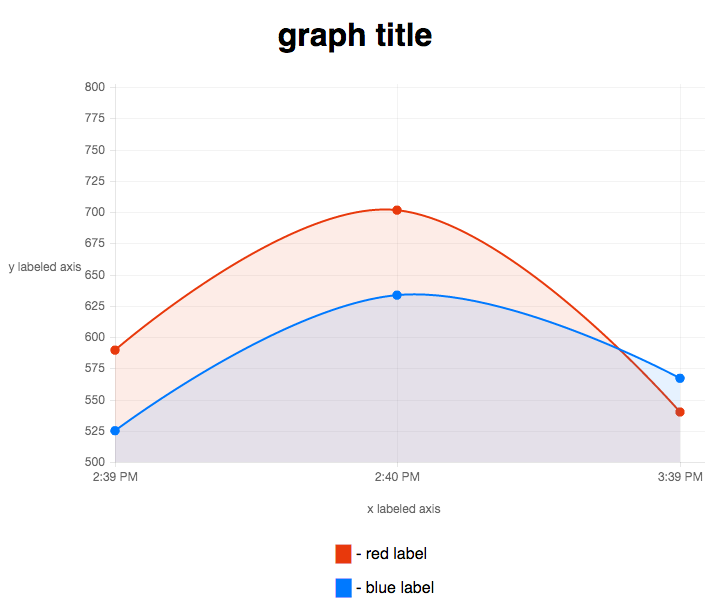

A very simple metrics collector.

Sample `secret.toml`

```
secret     = "123"
xAxisLabel = "x labeled axis"
yAxisLabel = "y labeled axis"
redLabel   = "red label"
blueLabel  = "blue label"
pageTitle  = "page title"
graphTitle = "graph title"
```


